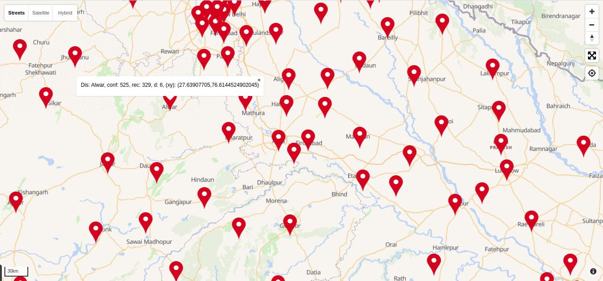

# cov-analytics

This is the source code of a [map visualization](https://c0dzilla.github.io/cov-analytics) of the district-wise distribution of covid-19 patients in India.

## Data

The district-wise patient distribution data has been taken from https://api.covid19india.org/, which is a volunteer-drived, crowd-sourced initiative. Although the data is regularly updated, it may not necessarily reflect the exact numbers at a particular point of time.

## Setup

The visualization uses [LocationIQ](https://locationiq.com/) for reverse geocoding of district coordinates from names and to generate the map. To setup your own instance, obtain an API key and substitute in the `lapi_key` variable initialization inside `index.js`.
